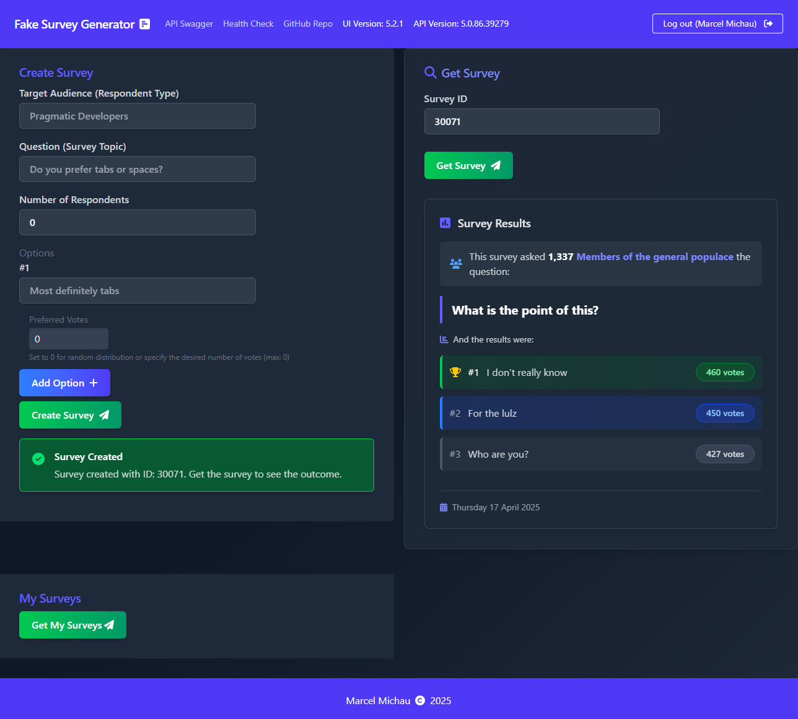

  

<h1 align="center">
  Fake Survey Generator
</h1>

This is an app. That generates surveys. Fake ones. For fun. That is all.

| Component                 | Build Status                                                                                                                                                                                                                                     |
| ------------------------- | ------------------------------------------------------------------------------------------------------------------------------------------------------------------------------------------------------------------------------------------------ |
| Fake Survey Generator API |  |
| Fake Survey Generator UI  |   |
| SQL Server                |                 |
| Redis                     |                      |

## Screenshot

## What is this?

This is an application of moderate complexity (not just a to-do app), used as a playground for experimentation. Simply put: This is where I mess around with code. It is heavily inspired by the [.NET Microservices: Architecture for Containerized .NET Applications](https://docs.microsoft.com/en-us/dotnet/architecture/microservices/) book, as well as its companion reference application [eShopOnContainers](https://github.com/dotnet-architecture/eShopOnContainers). It also incorporates various elements from different repos & blog posts which served as inspiration.

It is built using Clean Architecture principles with CQRS (Command Query Responsibility Segregation) and DDD (Domain-Driven Design) thrown into the mix. It doesn't follow these principles to the letter, but provides a decent example of how to apply the basics of these principles.

It also includes some examples that typical real-world applications might need to deal with:

- Unit & Integration tests for a CQRS/DDD project
- Running Unit & Integration tests with Docker Compose
- Using an in-memory database for testing
- Implementing health checks for an ASP.NET Core Web API
- Adding Swagger to an ASP.NET Core Web API
- Adding OpenID Connect for Authentication
- Adding OpenID Connect to Swagger UI
- Securing an ASP.NET Core Web API using JWT Bearer authentication
- Adding security headers to API responses
- Using AutoWrapper to return consistent API response models
- Using Hosted Services in ASP.NET Core Web API
- Using a distributed Redis cache
- Creating trusted SSL certificates for HTTPS in development
- Configuring SQL Server retry policies
- Using Polly to make resilient HTTP requests
- Implementing Forwarded Headers for hosting ASP.NET Core Web API behind a load balancer
- Validation of commands using FluentValidation
- Deploying Entity Framework Core Code-First Migrations to Azure SQL Server using Azure Pipelines
- Running a microservice application using Docker Compose
- Deploying a microservice application to Kubernetes using Helm charts
- Local Kubernetes development using Skaffold
- Using Azure Pipelines to Build & Deploy a microservice application to Azure Kubernetes Service
- Using Azure Key Vault with Azure Kubernetes Service to protect sensitive application configuration
- Configuring Azure Application Insights for telemetry
- Automatic semantic versioning using Nerdbank.GitVersioning

Some of the above features are relatively straightforward to implement, others have some intricacies that require some Googling in order to set up. I just like to have them placed in the context of a complete working application to refer back to when necessary.

## Why is this here?

I wanted something to try new things out on, without the risk of substantially endangering an actual production environment used by actual people.

It was for this reason that I built the Fake Survey Generator (FSG) app as a way to test out tools, libraries, patterns, frameworks & various other stuff.

It has a very simple domain: it generates surveys. Fake ones. They can be used as a tool for helping you decide what to have for dinner, which book you should read next, where you should go for your next team lunch, or anything that tickles your fancy.

This application is also used as a reference for configuring/wiring up some common things I sometimes forget how to do. _Living Documentation_ if you will. You know the culprits: How do I wire up that database again? What is the syntax for that logging configuration? How do I make thing A talk to thing B?

The domain is kept relatively simple such that it doesn't overwhelm the app with unnecessary complexity. It should be quite easy to wrap your head around without requiring a degree in Computer Science.

## How is this thing built?

FSG consists of two parts:

### Server

The server side consists of the following main components:

- Fake Survey Generator API
  - Domain Project
  - Domain Unit Tests Project
  - Infrastructure Project
  - Application Project
  - Application Tests Project
  - API Integration Tests Project
  - EF Design Project (used purely for EF Core design-time tooling)
  - Data Project (helpers for test data used across test projects)
- Fake Survey Generator Worker

The server side makes use of the following tools, libraries & frameworks:

- Fake Survey Generator API
  - .NET 5.0
  - ASP.NET Core 5.0 Web API
  - Entity Framework Core 5.0 with Code-First Migrations
  - Dapper
  - Redis
  - Swagger
  - AutoMapper
  - MediatR
  - FluentValidation
  - Polly
  - AspNetCore.Diagnostics.HealthChecks
  - Docker
  - Serilog
  - AutoWrapper
- Fake Survey Generator Worker
  - .NET 5.0
  - ASP.NET Core 5.0 Worker Service

### Client

The client side consists of the following main components:

- UI

The client side makes use of the following tools, libraries & frameworks:

- React
- TypeScript
- auth0.js
- Tailwind CSS
- PostCSS
- React Loading Skeleton
- NGINX
- Docker

### Common

The application is built for Docker, Docker Compose & Kubernetes with Helm. For local development, Docker Compose is used when debugging the application with Visual Studio, and Skaffold is used to package the application into a Helm chart to deploy to a local Kubernetes cluster for running locally.

The hosted version of the application is deployed to two environments:

- Test - https://aks-test.fakesurveygenerator.marcelmichau.dev
- Production - https://aks.fakesurveygenerator.marcelmichau.dev

The following endpoints are accessible:

- [/swagger](https://aks.fakesurveygenerator.marcelmichau.dev/swagger/index.html) - The Swagger documentation page for the API
- [/health/live](https://aks.fakesurveygenerator.marcelmichau.dev/health/live) - Health Checks endpoint used by Kubernetes liveness probe
- [/health/ready](https://aks.fakesurveygenerator.marcelmichau.dev/health/ready) - Health Checks endpoint used by Kubernetes readiness probe

The hosted version utilizes the following:

- Azure Kubernetes Service
- Azure SQL Database
- Azure Redis Cache
- Azure Container Registry
- Azure Key Vault
- Azure Application Insights
- Docker Hub
- Azure DevOps Services (for CI/CD)

## Authentication

The application makes use of OpenID Connect for authentication which is implemented by Auth0. Currently supported connections are:

- Auth0
- Google
- Microsoft

Initially, this project used IdentityServer for authentication, but I didn't feel like maintaining the separate IdentityServer project as well as the Fake Survey Generator, so I switched it out for Auth0 because authn/authz is hard and I prefer to delegate that responsibility to the people who know how to do it properly. :)

## How do I run this thing?

In order to run FSG on your local machine, you will need the following prerequisites:

To run with Docker Compose:

- Docker Desktop
- [mkcert](https://github.com/FiloSottile/mkcert) - To generate SSL certificates for local development
- Visual Studio (optional)

To run with Docker Compose:

1. After installing mkcert, run: `mkcert localhost` in the `certs` directory to create the localhost development certificates. If successful, the following will be printed:

   `The certificate is at "./localhost.pem" and the key at "./localhost-key.pem"`

2. In a Terminal/Command Prompt/PowerShell window in the project root, run:

   `docker-compose up`

3. In a browser, navigate to https://localhost:3000 to open up the Fake Survey Generator UI

or

1. Open `FakeSurveyGenerator.sln` in Visual Studio:

2. Make sure that the `docker-compose` project is selected as the startup project

3. Hit `F5` to debug the application, or `Ctrl` + `F5` to run without debugging

4. In a browser, navigate to https://localhost:3000 to open up the Fake Survey Generator UI

To run on local Kubernetes:

- Docker Desktop with Kubernetes enabled (Ensure that at least 2048 MB of Memory is allocated to Docker Engine)
- NGINX Ingress installed on the Kubernetes cluster
- Skaffold

To deploy to a local Kubernetes cluster:

1. Create an entry in your `hosts` file as follows:

   `127.0.0.1 k8s.local`

2. In a Terminal/Command Prompt/PowerShell window in the project root, run:

   `skaffold run`

3. In a browser, navigate to https://k8s.local to open up the Fake Survey Generator UI

## How do I contribute?

If you find a bug, want to add a feature, or want to improve the documentation, open up a PR!
