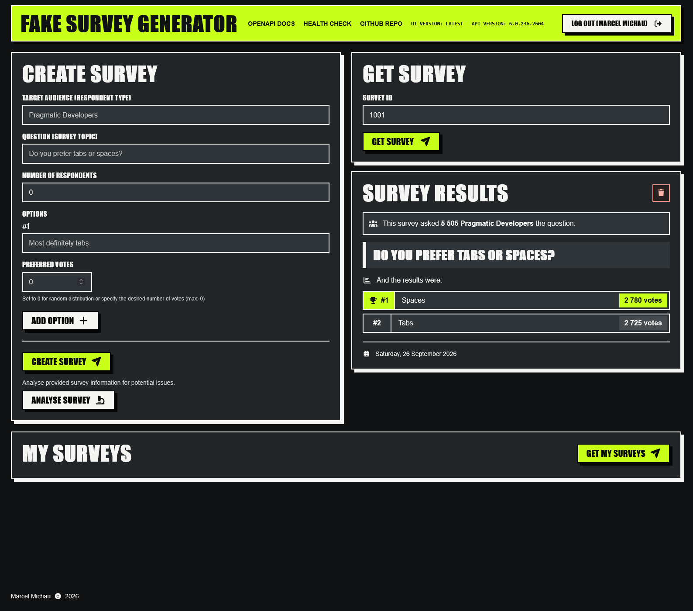

<h1 align="center">
  Fake Survey Generator
</h1>

<p align="center">
This is an app. That generates surveys. Fake ones. For fun. That is all.
</p>

[](https://dev.azure.com/marcelmichau/Personal/_build/latest?definitionId=26&branchName=main)

[Open in github.dev](https://github.dev/MarcelMichau/fake-survey-generator)

## Screenshot



## What is this?

This is a .NET | C# | React | TypeScript full-stack application of moderate complexity (not just a to-do app), used as a
playground for experimentation. Simply put: This is where I mess around with code. It is heavily inspired by
the [.NET Microservices: Architecture for Containerized .NET Applications](https://docs.microsoft.com/en-us/dotnet/architecture/microservices/)
book, as well as its companion reference
application [eShopOnAzure](https://github.com/Azure-Samples/eShopOnAzure). It also incorporates various
elements from different repos & blog posts which served as inspiration.

It is built using Vertical Slice Architecture principles with CQRS (Command Query Responsibility Segregation) and DDD (Domain-Driven Design) thrown into the mix. It doesn't follow these principles to the letter, but provides a decent
example of how to apply the basics of these principles.

It is heavily centered around the
Microsoft [.NET](https://dotnet.microsoft.com/) + [Azure](https://azure.microsoft.com/) technology stacks as these are
what I have the most experience in & just like building things with. 😀

Here are some of the features incorporated into this project:

### Application Features

- Observable, production ready, distributed application support
  using [Aspire](https://aspire.dev/)
- Unit & integration tests for a CQRS/DDD project with [TUnit](https://tunit.dev)
- Integration tests that start SQL Server and Redis through [Aspire testing](https://aspire.dev/testing/overview/)
- Server test doubles using [NSubstitute](https://nsubstitute.github.io/)
- Frontend unit and browser tests using [Vitest](https://vitest.dev/) and [Playwright](https://playwright.dev/)
- E2E acceptance tests
  using [Aspire Test Projects](https://aspire.dev/testing/overview/) & [Playwright for .NET](https://playwright.dev/dotnet/)
- Implementing `/health/live` and `/health/ready` health-check endpoints, including identity-provider readiness checks
  using [ASP.NET Core health checks](https://learn.microsoft.com/en-us/aspnet/core/host-and-deploy/health-checks)
- Adding [OpenAPI](https://learn.microsoft.com/en-us/aspnet/core/fundamentals/openapi/overview) to an ASP.NET Core Web API
  with [Scalar](https://github.com/scalar/scalar) for API documentation
- Adding [OpenID Connect](https://openid.net/connect/) for Authentication
- Adding OpenID Connect to Scalar
- Securing an ASP.NET Core Web API using JWT Bearer authentication
- Adding security headers to API responses
  using [NetEscapades.AspNetCore.SecurityHeaders](https://github.com/andrewlock/NetEscapades.AspNetCore.SecurityHeaders)
- Using [Hosted Services](https://docs.microsoft.com/en-us/aspnet/core/fundamentals/host/hosted-services) in ASP.NET
  Core Web API
- Using a distributed [Redis](https://redis.io/) cache
- Using [Microsoft.Extensions.Http.Resilience](https://learn.microsoft.com/en-us/dotnet/api/microsoft.extensions.http.resilience) for resilient HTTP requests
- Implementing [Forwarded Headers](https://docs.microsoft.com/en-us/aspnet/core/host-and-deploy/proxy-load-balancer) for hosting ASP.NET Core Web API behind a load balancer
- Validation of commands using [FluentValidation](https://fluentvalidation.net/)
- Configuring [Azure Monitor OpenTelemetry](https://learn.microsoft.com/en-us/azure/azure-monitor/app/opentelemetry-enable) for telemetry
- Using [Dapr](https://dapr.io/) with the [.NET SDK](https://github.com/dapr/dotnet-sdk) for secret-store configuration: a local file store during development and Azure Key Vault in production

### Infrastructure Features

- Automatic semantic versioning using [Nerdbank.GitVersioning](https://github.com/dotnet/Nerdbank.GitVersioning)
- Creating trusted SSL certificates for HTTPS in development
- Deploying Entity Framework Core Code-First Migrations
  to [Azure SQL Database](https://azure.microsoft.com/en-us/services/sql-database/)
  using [Azure Pipelines](https://docs.microsoft.com/en-us/azure/devops/pipelines/get-started/what-is-azure-pipelines?view=azure-devops)
- Using [Microsoft Entra ID](https://www.microsoft.com/en-us/security/business/identity-access/microsoft-entra-id)
  authentication to [Azure SQL Database](https://azure.microsoft.com/en-us/services/sql-database/) with Entity Framework
  Core
- Running a distributed application locally using [Aspire](https://aspire.dev/get-started/what-is-aspire/)
- Using Azure Pipelines with the [Azure Developer CLI](https://learn.microsoft.com/en-us/azure/developer/azure-developer-cli/overview) to provision infrastructure and deploy the API container
  to [Azure Container Apps](https://azure.microsoft.com/en-us/services/container-apps/#overview)
- Infrastructure as Code for Azure resources
  using [Bicep](https://docs.microsoft.com/en-us/azure/azure-resource-manager/bicep/overview)

Some of the above features are relatively straightforward to implement, others have some intricacies that require some
Googling in order to set up. I just like to have them placed in the context of a complete working application to refer
back to when necessary.

## Why is this here?

I wanted something to try new things out on, without the risk of substantially endangering an actual production
environment used by actual people.

It was for this reason that I built the Fake Survey Generator (FSG) app as a way to test out tools, libraries, patterns,
frameworks & various other stuff.

It has a very simple domain: it generates surveys. Fake ones. They can be used as a tool for helping you decide what to
have for dinner, which book you should read next, where you should go for your next team lunch, or anything that tickles
your fancy.

This application is also used as a reference for configuring/wiring up some common things I sometimes forget how to do.
_Living Documentation_ if you will. You know the culprits: How do I wire up that database again? What is the syntax for
that logging configuration? How do I make thing A talk to thing B?

The domain is kept relatively simple such that it doesn't overwhelm the app with unnecessary complexity. It should be
quite easy to wrap your head around without requiring a degree in Computer Science.

I also felt that a lot of reference/demo/boilerplate projects out there cover the core application domain & don't go
into much detail around the building/deployment/hosting of final application. So this project aims to cover both. It
contains application code, configuration, CI/CD pipelines, infrastructure-as-code needed to run the application, as well
as a live, running version of the application (as long as budget allows 😁). So this repo hopefully may contain something
for everyone & fill in the potential gaps across the whole spectrum of application development. It falls somewhere
between a template/boilerplate project & a real-world production open-source application.

## How is this thing structured?

FSG consists of two parts:

### Server

The server side consists of the following main components:

- Fake Survey Generator API
- Fake Survey Generator Worker
- Aspire AppHost
- Service Defaults
- Application Project
- Application Tests Project
- API Integration Tests Project
- E2E Acceptance Tests Project

The Aspire AppHost also runs SQL Server, Redis, Redis Insight, a Dapr sidecar, and the Vite UI during local development.

The server side makes use of the following tools, libraries & frameworks:

- Fake Survey Generator API
    - .NET 11 SDK (currently pinned to a .NET 11 RC in `global.json`)
    - [ASP.NET Core](https://learn.microsoft.com/en-us/aspnet/core) Minimal API
    - [Aspire](https://aspire.dev/get-started/what-is-aspire/)
    - [Entity Framework Core](https://learn.microsoft.com/en-us/ef/core/)
      with [Code-First Migrations](https://learn.microsoft.com/en-us/ef/core/managing-schemas/migrations/)
    - [Dapper](https://github.com/DapperLib/Dapper)
    - [Redis](https://redis.io/) distributed and hybrid caching
    - [Scalar](https://scalar.com/) and OpenAPI
    - [FluentValidation](https://fluentvalidation.net/)
    - [ASP.NET Core health checks](https://learn.microsoft.com/en-us/aspnet/core/host-and-deploy/health-checks)
    - [Docker](https://www.docker.com/)
- Fake Survey Generator Worker
    - .NET 11 SDK
    - [.NET Worker Service](https://learn.microsoft.com/en-us/dotnet/core/extensions/workers)

### Client

The client side consists of the following main components:

- UI

The client side makes use of the following tools, libraries & frameworks:

- [Vite](https://vitejs.dev/)
- [React](https://reactjs.org/)
- [TypeScript](https://www.typescriptlang.org/)
- [Auth0 React SDK](https://github.com/auth0/auth0-react)
- [Tailwind CSS](https://tailwindcss.com/)
- [PostCSS](https://postcss.org/)
- [React Loading Skeleton](https://github.com/dvtng/react-loading-skeleton)

For production, the UI is built by the API's Dockerfile and served by the API container; it does not have a separate UI Dockerfile.

### Common

The application is containerized and orchestrated locally with Aspire. During local development, the Aspire AppHost runs the
API, Worker, SQL Server, Redis, Redis Insight, Dapr, and the Vite UI. The UI is a separate Vite resource locally.

For production, the current Azure deployment publishes the API container only. The API Dockerfile builds the React UI and
serves its static files from `wwwroot`; the Worker is not currently deployed by `azure.yaml` or the Azure infrastructure.

In Development, the API applies Entity Framework migrations during startup. In production, Azure Pipelines generates a
migration script and executes it against Azure SQL as a separate deployment stage.

The hosted version of the application is deployed here: https://fakesurveygenerator.mysecondarydomain.com

The following endpoints are accessible:

- [/api-docs](https://fakesurveygenerator.mysecondarydomain.com/api-docs) - Scalar OpenAPI documentation UI
- [/openapi/v1.json](https://fakesurveygenerator.mysecondarydomain.com/openapi/v1.json) - OpenAPI 3.1 JSON document
- [/health/live](https://fakesurveygenerator.mysecondarydomain.com/health/live) - Liveness endpoint used by Azure
  Container Apps ingress; it does not check external dependencies
- [/health/ready](https://fakesurveygenerator.mysecondarydomain.com/health/ready) - Readiness endpoint used by Azure
  Container Apps ingress; it runs the configured readiness checks

The hosted version utilizes the following infrastructure:

- [Azure Container Apps](https://azure.microsoft.com/en-us/services/container-apps/#overview) for the API and Redis
- [Azure SQL Database](https://azure.microsoft.com/en-us/services/sql-database/)
- [Azure Container Registry](https://azure.microsoft.com/en-us/services/container-registry/)
- [Azure Key Vault](https://azure.microsoft.com/en-us/services/key-vault/)
- [Azure Log Analytics](https://learn.microsoft.com/en-us/azure/azure-monitor/logs/log-analytics-overview)
- [Azure Application Insights](https://learn.microsoft.com/en-us/azure/azure-monitor/app/app-insights-overview)
- [Azure Container Apps managed certificates](https://learn.microsoft.com/en-us/azure/container-apps/custom-domains-managed-certificates)
- [Azure DNS](https://learn.microsoft.com/en-us/azure/dns/dns-overview)
- [Azure DevOps](https://azure.microsoft.com/en-us/services/devops/) (for CI/CD)

## Authentication

The application uses [OpenID Connect](https://openid.net/connect/) through [Auth0](https://auth0.com/). The API
validates Auth0 JWT bearer tokens with the audience `fake-survey-generator-api`, while the React UI uses the Auth0 React
SDK. The Auth0 tenant's enabled connections are external configuration; the current tenant supports:

- Auth0
- Google

The client configuration is in `src/client/ui/src/auth_config.json`, and the local API identity-provider URL is in
`src/server/FakeSurveyGenerator.Api/appsettings.Development.json`. If you use a different Auth0 tenant, update both
configurations and configure its allowed callback/logout URLs for the local and deployed UI origins.

### Semantic survey analysis

The **Analyse Survey** button uses TypeSafe to check survey wording and options for potential issues such as leading questions, multiple-choice ambiguity, incomplete coverage, and semantically duplicate options. Configure the API key on the server; never expose it to the browser:

```bash
TYPESAFE_API_KEY=your-key
```

`TYPESAFE_BASE_URL` and `TYPESAFE_MODEL` are optional and default to `https://api.typesafe.ai/` and `jev-latest`.

For Azure deployments, configure `typeSafeApiKey` as a secret Azure Pipelines variable. The deployment seeds it into Azure Key Vault and exposes it to the API container through a managed-identity-backed secret reference.

## How do I run this thing?

In order to run FSG on your local machine, you will need the following prerequisites:

- [Visual Studio 2026](https://visualstudio.microsoft.com/vs/) or another IDE that supports the .NET 11 SDK
- The .NET 11 SDK version pinned in `global.json` (currently a prerelease SDK)
- [Docker](https://www.docker.com/products/docker-desktop) or [Podman](https://podman.io/)
- [Dapr CLI](https://docs.dapr.io/getting-started/install-dapr/), initialized with `dapr init`
- [Node.js and npm](https://nodejs.org/), required by the Vite UI resource

The local AppHost uses the Dapr component in `dapr/components/local-file.yml` and its accompanying
`dapr/components/secrets.json` file for development secrets.

1. Open `FakeSurveyGenerator.slnx` in Visual Studio 2026, or in an IDE with .NET 11 SDK support.

2. Ensure that the `FakeSurveyGenerator.AppHost` project is selected as the startup project.

3. Hit `F5` to debug the application, or `Ctrl` + `F5` to run without debugging.

4. The [Aspire Dashboard](https://aspire.dev/dashboard/overview/) should open automatically, along with the local UI.

## How do I contribute?

If you find a bug, want to add a feature, or want to improve the documentation, open up a PR!

## References

My deepest thanks to all the people who provided these resources as reference:

- [.NET Microservices: Architecture for Containerized .NET Applications](https://docs.microsoft.com/en-us/dotnet/architecture/microservices/)
- [eShopOnContainers](https://github.com/dotnet-architecture/eShopOnContainers)
- [jasontaylordev/CleanArchitecture](https://github.com/jasontaylordev/CleanArchitecture)
- [nadirbad/VerticalSliceArchitecture](https://github.com/nadirbad/VerticalSliceArchitecture)
- [Vladimir Khorikov - Applying Functional Principles in C#](https://pluralsight.com/courses/csharp-applying-functional-principles)
- [Vladimir Khorikov - Functional C#: Primitive obsession](https://enterprisecraftsmanship.com/posts/functional-c-primitive-obsession/)
